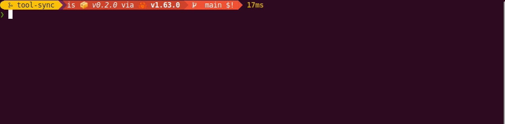

# tool-sync

[](https://github.com/chshersh/tool-sync/actions)
[](https://github.com/chshersh/tool-sync/releases/latest)
[](LICENSE)

`tool-sync` is a CLI tool that solves one problem:

**📥 Download pre-built binaries of all your favourite tools with a single command.**

`tool-sync` embraces the idea that configuring your personal development
environment should be as easy as possible. And the life is pretty easy when all
the tools are simple executables.

**So why not simply download all the executables you use and put them in a single place???** 🚀 😱



> ℹ️ **DISCLAIMER:** `tool-sync` is developed and maintained in free time
> by volunteers. The development may continue for decades or may stop
> tomorrow. You can use
> [GitHub Sponsorship](https://github.com/sponsors/chshersh) to support
> the development of this project.

## Quick start guide

With `tool-sync`, you can install all the tools you use by following three
simple steps:

1. [Install `tool-sync`](#install).
2. [Configure](#configure) `tool-sync` by describing all the tools you want.
3. Run `tool sync`.

That's all! 🥳

The `tool sync` command does the following:

1. Fetches the information about tools from GitHub Releases
2. Automatically guesses the asset name from your OS for common tools
3. Downloads and unpacks assets
4. Copies binaries from unpacked assets to the location of your choice

## Features

`tool-sync` has several distinguished features that allows you to manage your
personal toolbox easily:

* 🚀 Installs the latest version of tools by default
* 🧹 Helps you to avoid boilerplate configuration for popular tools
* 📜 Configures via a simple TOML file
* ☸️ Cross-platform: works on Linux🐧, macOS🍏 and Windows💠
* 🪶 No runtime dependencies: doesn't require any other tools to do the job

## Limitations

Currently, `tool-sync` has a few limitations:

* Supports downloading pre-built binaries only from GitHub Releases
* Doesn't support other configuration besides downloading the binary
  (e.g. copying additional assets or setting up auto-completion)
* Doesn't avoid downloading of the same version

## Project goals

> This project is created in pursue of the following goals. Feature requests not
> compatible with the following list of goals might be rejected.

1. **Learning Rust.**
    + I like learning by creating new things. I'm learning a lot while working
      on `tool-sync` and at the same time I find this tool useful for myself! So,
      please, don't ask "Why create another package manager?". It's not even a
      package manager 😒
2. **Single-command batch installation.**
    + Another `tool-sync` is to be able to configure it once and forget about it
      (ideally forever) and use with the minimal overhead. Installing lots of
      tools with a single command helps achieving this goal.
3. **Informative messages.**
    + When something doesn't work, it should be clear "Why?" and
      "How to fix it?". `tool-sync` strives to provide good error messages (but
      this is an endless work).

## Install

### From binary releases (recommended)

You can install `tool-sync` directly from GitHub releases in a few steps:

1. Go to the [latest release](https://github.com/chshersh/tool-sync/releases/latest).
2. Download an asset for your OS.
3. Unpack the `tool` executable to a desired location.

Good news, you only need to do this once! `tool-sync` will automatically manage
future installations of itself (if you add it to your config).

> ℹ️ Installing pre-built binaries for `tool-sync` is the recommended option
> because they are:
>
>   + **Statically linked** (so they work out-of-the-box on every system)
>   + **Stripped** (so their size is reduced)

### From crates

You can use `cargo` to install the latest published version of `tool-sync` from crates:

```shell
cargo install tool-sync
```

### From sources

You can install the latest version of `tool-sync` from sources (requires `git`
and `cargo`):

```shell
git clone https://github.com/chshersh/tool-sync
cd tool-sync
cargo build --release
./target/release/tool --version
```

## Configure

Before using `tool-sync`, you need to configure it by specifying the location
for downloading the tools and listing all the tools you want.

By default `tool-sync` reads the configuration from from the `$HOME/.tool.toml`
path. But you can specify a custom location via the
`--config=/path/to/my/config` flag.

### Quick start

`tool-sync` has a command to generate a default configuration with examples and
field description. Simply generate it into a file and edit it:

```shell
tool default-config > ~/.tool.toml  # generate the default config
vim ~/.tool.toml                    # open it with an editor of your choice
```

### Simple example

Below you can find a simple configuration example:

```toml
# a directory to store all tools
store_directory = "~/.local/bin"

# the following tools will be installed in 'store_directory'
[bat]
[difftastic]
[exa]
[fd]
[ripgrep]
```

> ℹ️ `tool-sync` automatically expands the tilde `~` and environment variables
> (e.g `$HOME`) in the `store_directory` field.

You can also quickly copy the above configuration to the default path by running
the following command (Unix-only):

```shell
curl https://raw.githubusercontent.com/chshersh/tool-sync/main/example-tool-sync-config.toml > ~/.tool.toml
```

The above example config lists some tools natively supported by `tool-sync` and
therefore they don't require extra configuration.

### Advanced configuration

To specify a tool not supported by `tool-sync`, add a TOML table entry and list
all the required fields like in the example below:

```toml
[tokei]
owner    = "XAMPPRocky"  # GitHub username
repo     = "tokei"       # GitHub repository
exe_name = "tokei"       # Executable name inside the asset

# uncomment to download a specific version or tag
# tag = "12.1.1"

# Asset name to download on linux OSes
asset_name.linux = "x86_64-unknown-linux-musl"

# Uncomment if you want to install on macOS as well
# asset_name.macos = "apple-darwin"

# Uncomment if you want to install on Windows as well
# asset_name.windows = "x86_64-pc-windows-msvc"
```

> ℹ️ `tool-sync` searches asset name using the _substring search_. That's why
> you don't need to specify the full asset name in the config, only the minimal
> part required for identifying the asset. However, `tool-sync` doesn't guarantee
> you to find the asset you need if multiple assets from the GitHub release match
> the substring.

All fields in each tool section are

+ **required for unknown tools,**
+ _optional for known tools._

This means that you can override only some of the fields for known tools.

This can be helpful if e.g. you want to install a custom version of `ripgrep`
from a forked repository. To do this, specify only the repository owner in the
config:

```toml
[ripgrep]
owner = "me"
```

## Usage

Install all the tools specified in `~/.tool.toml`:

```shell
tool sync
```

Install one tool specified in `~/.tool.toml`:

```shell
tool sync exa
```

Install all the tools from config in a different location:

```shell
tool --config=path/to/my/config.toml sync
```

Install a tool that is hardcoded in the known tools list:

```shell
tool install ripgrep
```

Print the default config to stdout:

```shell
tool default-config
```

Run `tool --help` for more details.

> :octocat: If you hit the limit for downloading assets or want to download
> assets from private repositories,
> [create a personal access token](https://docs.github.com/en/authentication/keeping-your-account-and-data-secure/creating-a-personal-access-token)
> and export it as the `GITHUB_TOKEN` environment variable.

## Alternatives

This section contains `tool-sync` comparison to existing alternatives:

1. **Manual download**: you can download GitHub releases manually without using
   any extra tools.

   + **Pros**
     + No extra tools required, only your browser and unpack utility
   + **Cons**
     + Tedious manual process

2. **GitHub CLI**: you can download assets from releases using
   [the GitHub CLI tool `gh`][gh].

   ```shell
   gh release download --repo chshersh/tool-sync v0.0.0 --pattern='*linux*'
   tar -xvf tool-x86_64-unknown-linux-gnu.tar.gz
   ./tool --version
   ```

   + **Pros**
     + Using a more common tool (that you probably have)
   + **Cons**
     + Can't download multiple tools with a single command
     + Can't guess the asset name by your OS

3. [**home-manager**][home-manager]: provides a full-featured solution for
   managing a user environment using the Nix package manager.

   + **Pros**
     + Supports more than downloading tools from GitHub Releases
     + Access to the bigger Nix ecosystem
   + **Cons**
     + More complicated solution
     + Requires learning and using Nix

4. [**topgrade**][topgrade]: a CLI tool for automatically upgrading everything
   you have on your system. Its similar to `tool-sync` in a sense that it uses the
   latest version but it relies on existing packages managers and doesn't install
   new tools.

   + **Pros**
     + Leverages your existing package managers and their configuration
     + Support plugins, editor configs and much more besides executable tools
   + **Cons**
     + Only updates, doesn't install new

5. [**cargo-binstall**][cargo-binstall]:

   + **Pros**
     + Installs more Rust tools than `tool-sync` without configuration
     + Builds a tool from sources if it doesn't provide a binary release
   + **Cons**
     + Supports only Rust tools
     + Doesn't install multiple tools with a single command

6. [**dra**][dra]: the closest alternative to `tool-sync`. It's a CLI tool,
   written in Rust, that allows downloading individual releases easily.

   + **Pros**
     + Convenient interface for downloading a single release
   + **Cons**
     + Can't download multiple tools with a single command
     + Can't guess the asset name by your OS

7. [**clyde**][clyde]: another alternative to `tool-sync`

   + **Pros**
     + Package integrity checks
     + Supports man pages
     + Doesn't require to select a location for installing tools
   + **Cons**
     + Tools can't be installed if not added in a central repository
     + Can't install multiple tools with a single command
     + Has runtime dependencies: `git` and `tar`

[gh]: https://github.com/cli/cli
[home-manager]: https://github.com/nix-community/home-manager
[topgrade]: https://github.com/r-darwish/topgrade
[cargo-binstall]: https://github.com/cargo-bins/cargo-binstall/
[dra]: https://github.com/devmatteini/dra
[clyde]: https://github.com/agateau/clyde

## Adding a new tool

`tool-sync` contains [a database of common tools][db] and provides easier
support for them. It's possible to add more tools (and you can suggest them!).
The following list contains guidelines for including a new tool. They don't
serve as gatekeeping criteria but more as points system:

* 6 months passed since the tool release
    + So that the database won't be populated with fresh tools that are never
      supported
* At least 3 releases
    + To ensure stable naming scheme for assets
* Commonly used tool
    + `tool-sync` strives to be generic so it might not want to support a DNA
      analysis CLI tool which is useful only for a specific group
* The `tool-sync` author find the tool helpful
    + In the end, there're people behind `tool-sync` who maintain this project
      while the rest of the world benefits from it for free. At least, `tool-sync`
      authors decide what they want to use and whether they want to support a tool indefinitely.

[db]: https://github.com/chshersh/tool-sync/blob/main/src/sync/db.rs

## For contributors

Check [CONTRIBUTING.md](https://github.com/chshersh/tool-sync/blob/main/CONTRIBUTING.md)
for contributing guidelines.

## Development

### Build

Use `cargo` to build the project and run all tests:

```shell
cargo build
cargo test
```

### Pre-commit hooks

There is a predefined `.pre-commit-config.yaml` that you can install using
[pre-commit](https://pre-commit.com/). This will make sure the linting checks
are run locally before committing changes.

### Update the default config golden test

When changing the format of the default configuration, run the following command
to quickly update the golden `default-config.toml` test:

```shell
cargo run -- default-config > tests/default-config.toml
```
